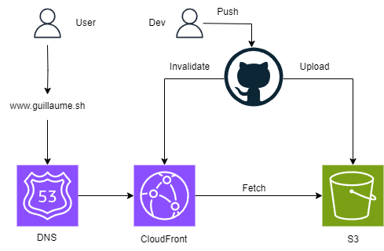

# AWS Deployment Setup for Static Website

This document outlines the process of deploying a static website using AWS services, including S3, CloudFront, Route 53, and Certificate Manager. It also includes GitHub Actions for continuous deployment.

## Architecture Overview

1. **S3**: Stores static assets
2. **CloudFront**: Content Delivery Network (CDN) for global distribution
3. **Route 53**: DNS management
4. **Certificate Manager**: SSL/TLS certificate provisioning
5. **GitHub Actions**: Automated build and deployment


## Setup from scratch
### Step 1: S3 Bucket Setup

1. Create two S3 buckets:
   - `your-domain.com`
   - `www.your-domain.com`

2. Configure buckets:
   - Enable static website hosting on the main bucket (`your-domain.com`)
   - Set up redirect from `www` to the main bucket
   - Apply read-only policy to the main bucket

3. Build the website locally:
   ```bash
   pnpm build
   ```

4. Transfer built assets to S3:
   ```bash
   aws s3 sync ./dist s3://your-domain.com --delete
   ```

## Step 2: SSL/TLS Certificate

1. Request a certificate in AWS Certificate Manager:
   - Include both `your-domain.com` and `www.your-domain.com`
   - Choose DNS validation
   
2. Add the provided CNAME records to your DNS configuration

### Step 3: CloudFront Distribution

1. Create a new CloudFront distribution:
   - Origin: S3 website endpoint (not the bucket itself)
   - Alternate domain names: `your-domain.com` and `www.your-domain.com`
   - SSL Certificate: Select the one created in Step 2
   - Default root object: `index.html`

2. Configure error pages:
   - For single-page applications, create a custom error response:
     - Error code: 403
     - Response page path: `/index.html`
     - HTTP Response Code: 200

### Step 4: Route 53 Configuration

1. Create/update DNS records:
   - `A` record for `your-domain.com` → Alias to CloudFront distribution
   - `A` record for `www.your-domain.com` → Alias to CloudFront distribution

### Step 5: S3 Bucket Policy

1. Update the S3 bucket policy to only allow access from CloudFront:

```json
{
    "Version": "2012-10-17",
    "Statement": [
        {
            "Sid": "AllowCloudFrontServicePrincipal",
            "Effect": "Allow",
            "Principal": {
                "Service": "cloudfront.amazonaws.com"
            },
            "Action": "s3:GetObject",
            "Resource": "arn:aws:s3:::your-domain.com/*",
            "Condition": {
                "StringEquals": {
                    "AWS:SourceArn": "arn:aws:cloudfront::your-account-id:distribution/your-distribution-id"
                }
            }
        }
    ]
}
```

Replace `your-account-id` and `your-distribution-id` with your actual values.

2. Remove the public static asset serving

3. Turn off public access of the bucker

## Step 6: GitHub Actions for Continuous Deployment

Create a `.github/workflows/deploy.yml` file with the [deploy instruction](./.github/workflows/main.yml)

Ensure you set up the following secrets in your GitHub repository:
- `AWS_ACCESS_KEY_ID`
- `AWS_SECRET_ACCESS_KEY`
- `CLOUDFRONT_DISTRIBUTION_ID`
- `BUCKET_ID`

## Notes

- Allow time for DNS propagation and certificate validation (up to 24 hours in some cases).
- For single-page applications, configure CloudFront to redirect all 404 errors to `index.html`.

# Schema


